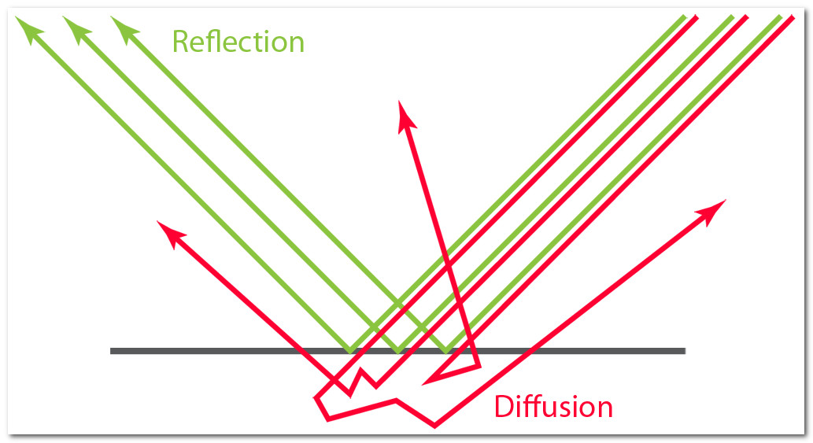
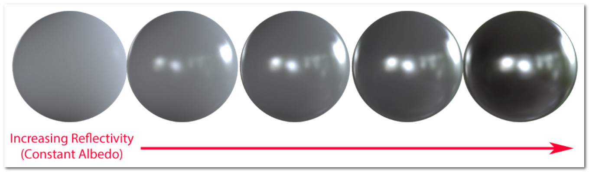
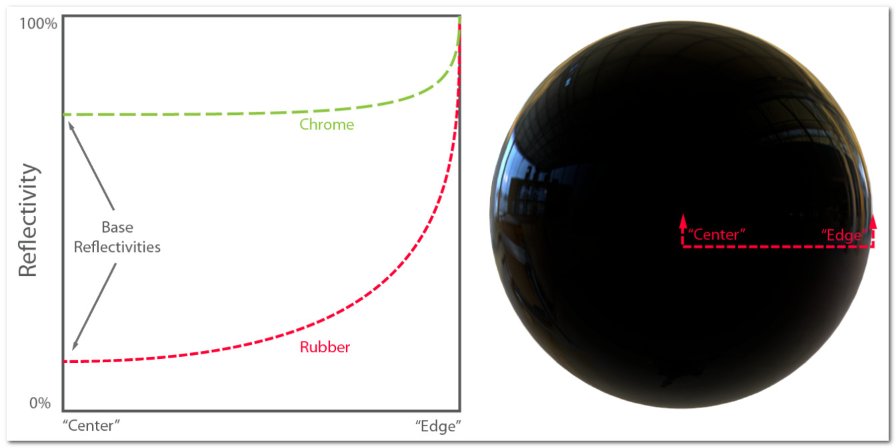
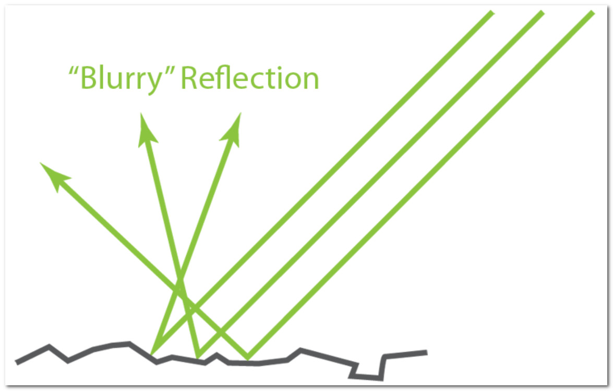

# Basic Theory of Physically-Based Rendering

[Source](https://marmoset.co/posts/basic-theory-of-physically-based-rendering/)

## Diffusion & Reflection

Diffusion and reflection - also known as "diffuse" and "specular" light respectively - are two terms describing the most basic separation of surface/light interactions . Most perple will be familiar with these ideas on a practical level , but may not know how they are physically distinct .

When light hits a surface boundary some of it will reflect - that is , bounce off - from the surface and leave heading in a direction on the opposing side of the surface normal . This behaviour is very sililar to a ball thrown against the ground or a wall - it will bounce off at the opposite angle . On a smooth surface this will result in a mirror-like appearance . The word "specular" , often used to describe the effect , is derived from the latin for "mirror" (it seems "specularity" sounds less awkward than "mirrorness").

Not all light reflects from a surface , however . Usually some will penetrate into the interior of the illuminated object . There it will either be absorbed by the material (usually converting to heat) or scattered internally . Some of this scattered light may make its way back out of the surface , then becoming visible once more to eyeballs and cameras . This is known by many names : "Diffuse Light" , "Diffusion" , "Subsurface Scattering" - all describe the same effect .

The absorption and scattering of diffuse light are often quite different for different wavelengths of light , which is what gives objects their color (e.g. if an object absorbs most light but scatters blue , it will appear blue) . The scattering is often so uniformly chaotic that it can be said to appear the same from all directions - quite different from the case of a mirror ! A shader using this approximation really just needs one input : "albedo" , a color which describes the fractions of various colors of light that will scatter back out of a surface . "Diffuse Color" is a phrase sometimes used synonymously .

## Translucency & Transparency

In some cases diffusion is more complicated - in materials that have wider scattering distances for example , like skin or wax . In these cases a simple color will usually not do , and the shading system must take into account the shape and thickness of the object being lit . If they are thin enough , such objects often see light scattering out the back side and can then be called translucent . If the diffusion is even lower yet (in for example , glass) then almost no scattering is evident at all and entire images can pass through an object from one side to another intact . These behaviours are different enough from the typical "close to the surface" diffusion that unique shaders are usually needed to simulate them .

## Energy Conservation

With these descriptions we now have enough information to draw an important conclusion , which is that **reflection** and **diffusion** are mutually exclusive . This is because , in order for light to be diffused , light must first penetrate the surface (that is , fail to reflect) . This is known in shading parlance as an example of "energy conservation" , which just means that the light leaving a surface is never any brighter than which fell upon it originally .

This is easy to enforce in a shading system : one simply subtracts reflected light before allowing the diffuse shading to occur . This means highly reflective objects will show little to no diffuse light , simply because little to no light penetrates the surface , having been mostly reflected . The converse is also true : if an object has bright diffusion , it cannot be especially reflective .

Energy conservation of this sort is an important aspect of physically-based shading . It allows the artist to work with reflectivity and albedo values for a material without accidentally violating the laws of physics (which tends to look bad) . While enforcing these constraints in code isn't strictly necessary to producing good looking art , it does serve a useful role as a kind of "nanny physicist" that will prevent artwork from bending the rules too far or becoming inconsistent under different lighting conditions .

## Metals

Electrically conductive materials , most notably metals, are deserving of special mention at this point for a few reasons .

Firstly , they tend to be mush more reflective than insulators (non-conductors) . Conductors will usually exhibit reflectivities as high as 60% - 90% , whereas insulators are generally much lower , in the 0 - 20% range . These high reflectivities prevent most light from reaching the interior and scattering , giving metals a very "shiny" look .

Secondly , reflectivity on conductors will sometimes very across the visible spectrum , which means that their reflections appear tinted . This coloring of reflection is rare even among conductors , but it does occur in some everyday materials (e.g. gold , copper , and brass ) . Insulators as general rule do not exhibit this effect , and their reflections are uncolored .

Finally , electrical conductors will usually absorb rather than scatter any light that penetrates the surface . This means that in theory conductors will not show any evidence of diffuse light . In practice however there are often oxides or other residues on the surface of a material that will scatter some small amounts of light .

It is this duality between metals and just about evetything else that leads some rendering systems to adopt "metalness" as a direct input . In such systems artists specify the degree to which a material behaves as a metal , rather than specifying only the albedo & reflectivity explicitly . This is sometimes preferred as a simpler means of creating materials , but is not necessarily a characteristic of physically-based rendering .

## Fresnel

**Augustin-Jean Fresnel seems to be one of those old dead white guys we are unlikely to forget , mainly because his name is plastered on a range of phenomena that he was the first to accurately describe . It would be hard to have a discussion on the reflection of light without his name coming up .

In computer graphics the word Fresnel refers to differing reflectivity that occurs at differen angles . Specifically , light that lands on a surface at a grazing angle will be much more likely to reflect than that which hits a surface dead-on . This means that objects renered with a proper Fresnel effect will appear to have brighter reflections near the edges . Most of us have been familiar with this for a while now , and its presence in computer graphics is not new . However , PBR shaders have made popular a few impotrant corrections in the evaluation of Fresnel's equations .

The first is that for all materials , reflectivity becomes total for grazing angles - the "edges" viewed on any smooth object should act as perfect (uncolored) mirrors , no matter the material . Yes , really - any substance can act as a perfect mirror if it is smooth and viewed at the right angle ! This can be counterintuitive , but the physics are clear .

The second observation about Fresnel properties is that the curve or gradient between the angles does not vary much from material to material . Metals are the most divergent , but they too can be accounted for analytically .

What this means for us is that , assuming realism is desired , artist control over Fresnel behavior should generally be reduced , rather than expanded . Or at the very least , we now know where to set our default values !

This is good news of a sort , because it can simplify content generation . The shading system can now handle the Fresnel effect almost entirely on its own ; it has only to consult some of the other pre-existing material properties , such as gloss and reflectivity .

A PBR workflow has the artist specify , by one means or another , a "base reflectivity" . This provides the minimum amount and color of light reflected . The Fresnel effect , once rendered , will add reflectivity on top of the artist specified value , reaching up to 100% (white) at glancing angles . Essentially the content describes the base , and Fresnel's equations take over from there , making the surface more reflective at various angles as needed .

There is one big caveat for the Fresnel effect - it quickly becomes less ecident as surfaces become less smooth . More information on this interaction will be given a bit later on .

## Microsurface

The above descriptions of reflection and diffusion both depend on the orientation of the surface . On a large scale , this is supplied by the shape of the mesh being rendered , which may also make use of a normal map to describe smaller details . With this information any rendering system can go to town , rendering diffusion and reflection quite well .

However , there is one big piece still missing . Most real-world surfaces have very small imperfections : tiny grooves , cracks , and lumps too little for the eye to see , and much too small to represent in a normal map of any sane resolution . Despite being invisible to the naked eye , these microscopic features nonetheless affect the diffusion and reflection of light .

Microsurface detail has the most noticeable effect on reflection (subsurface diffusion is not greatly affected and won't be discussed further here) . In the diagram above , you can see parallel lines of incoming light begin to diverge when reflected from a rougher surface , as each ray hits a part of the surface with a different orientation . The analog in the ball/wall analogy would be a cliffside or something similarly uneven : the ball is still going to bounce off but at an unpredictable angle . In short , the rougher the surface gets , the more the reflected light will diverge or appear "blurry" .

