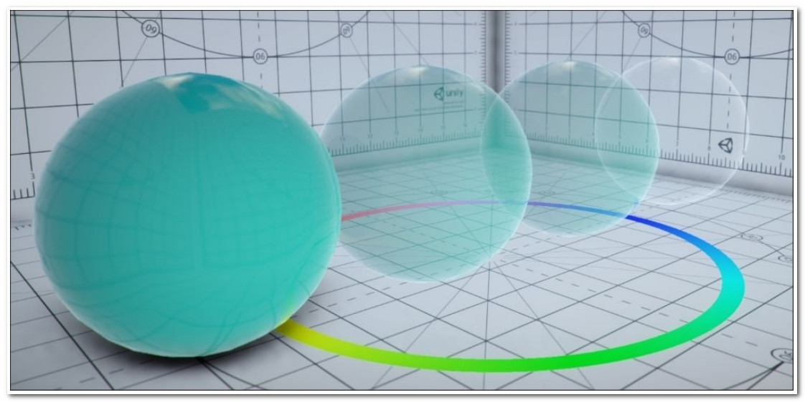
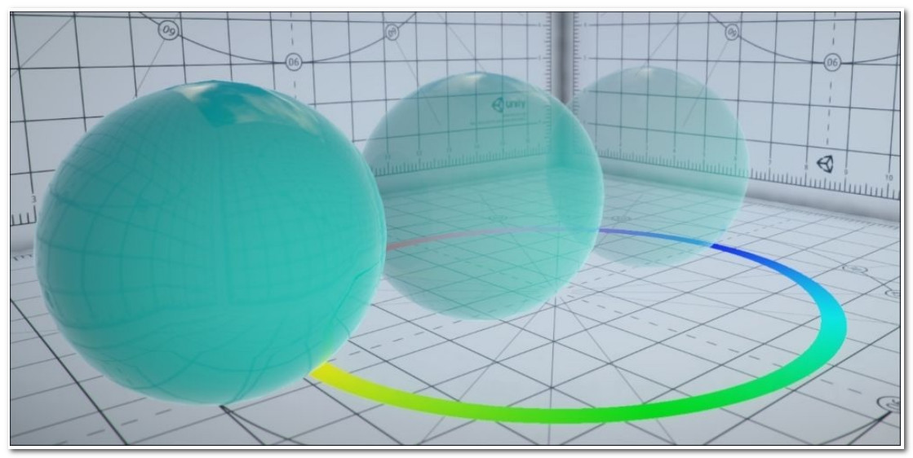

# Physical Based Rendering in Unity 5

Unity 5 implements PBR by introducing two important changes . The first is a completely new lighting model (called **Standard**) . Surface Shaders allow developers to specify the physical properties of a material , but they do not impose actual physical constraints on them . PBR fills this gap using a lighting model that enforces principles of physics such as **energy conservation** (an object cannot reflect more light than the amount it receives) , **microsurface scattering** (rough surfaces reflect light more erratically compared to smooth ones) , **Fresnel reflectance** (specular reflections appear at grazing angles) , and **surface occlusion** (the darking of corners and other geometries that are hard to light) . All these aspects , and many others , are used to calculate the Standard lighting model . The second aspect that makes PBR so realistic is called **Global Illumination (GI)** and is the simulation of physically-based light transport . It means that objects are not drawn in the scene as if they were separate entities . They all contribute to the final rendering as light can reflect on them before hitting something else . This aspect is not captured in the shaders themselves but is an essential part of how the rendering engine works . Unfortunately , accurately simulating how light rays actually bounce over surfaces in real time is beyond the capabilities of modern GPUs . Unity 5 makes some clever optimizations that allow retaining visual fidelity without sacrificing performance . Some of the most advanced techniques (such as reflections) , however , require the user input . It is important to remember that PBR and GI do not automatically guarantee that your game will be photorealistic . Achieving photorealism is a very challenging task and , like every art , it requires great expertize and exceptional skills .

## Understanding the metallic setup

Unity 5 provides two different types of PBR shaders ; they are referred to in the drop-down menu of the material's inspector tab as **Standard** and **Standard (Specular setup)** . The main difference is that the former exposes the **Metallic** property , while the latter replaces it with **Specular** . Both these metallic and specular setups represent different ways in which one can initialize PBR materials . One of the concepts that has driven PBR is the ability to provide meaningful , physically-related properties that artists and developers can tweak and play with . The properties of some materials are easier to represent indicating how **metallic** they are , while for some , the other is more important in order to define how they reflect lights directly . If you have used Unity 4 in the past , **Standard (Specular setup)** might look more familiar to you . This recipe will show you to use the **metallic setup** effectively . It's important to remember that the metallic workflow is not just for metallic materials ; it is a way to define how materials will look according to how metallic or non-metallic their surface is . 

## How to do it ...

There are two main textures that need to be configured in the Standard Shader : **Albedo** and **Metallic** . To use the metallic workflow effectively , we need to initialize these maps correctly :

1. The **Albedo** map should be initialized with the unlit texture of the 3D model .
2. To create the **Metallic** map , start by duplicating the file for your **Albedo** map . You can do this by selecting the map from the Project tab and pressing Ctrl + D .
3. Use white (#ffffff) to color the regions of the map that correspond to materials that are made of pure metal . Use black (#000000) for all the other colors . Shades of grey should be used for dusty , weathered , or worn out metal suffaces , rust , scratched paint , and so on . As a matter of fact , Unity uses only the red channel to store the metallic value ; the green and blue ones are ignored .
4. Use the alpha channel of the image to provide information about the **Smoothness** of the material .
5. Assign the **Metallic** map to the material . Both **Metallic** and **Smoothness** sliders will disappear as these two properties are now controlled by the map .

## How it works ...

Legacy Shaders allow artists to create materials that easily break the illusion of photorealism by having lighting conditions that are impossible in reality . This happens because all the properties of a material exposed in a Legacy Surface Shader are uncorrelated . By introducing the metallic workflow , Unity 5 imposes more constraints on the way objects look , making it harder for artists to create illogical materials . 

Metals are known for the conducting of electricity ; light is in the form of electromagnetic waves , meaning that almost all metals behave in a similar way compared to non-conductors (often referred as insulators) . Conductors tend to reflect most photons (70 - 100%) , resulting in high reflectance . The remaining light is absorbed , rather than diffused , suggesting that conductors have a very dark diffuse component . Insulators , conversely , have a low reflectance (4%) ; the rest of the light is scattered on the surface , contributing to their diffused looks .

In the Standard Shader , purely metallic materials have dark diffuse components and the color of their specular reflections is determined by the **Albedo** map . Conversely , the diffuse component of purely non-metallic materials is determined by the **Albedo** map ; the color of their specular highlights is determined by the color of the incoming light . Following these principles allows the metallic workflow to combine the albedo and specular into the **Albedo** map , enforcing physically-accurate behaviors . This also allows saving more space , resulting in a significant speed up at the expenses of reduced control over the look of your materials .

## Adding transparency to PBR

Transparency is such an important aspect in games that the Standard Shader supports three different ways of doing it . This recipe is useful if you need to have realistic materials with transparent or semi-transparent properties . Glasses , bottles , windows , and crystals are good condidates for PBR transparent shaders . This is because you can still have all the realism introduced by PBR with the addition of a tranparent or translucent effect . If you need transparency for something different such as UI elements or pixel art , there are more efficient alternatives that are explored in the *Creating a transparent material recipe in Chapter 2 , Surface Shaders and Texture Mapping* .

### How to do it ...

The Standard Shader provides three different types of transparencies . Despite being very similar , they have subtle differences and fit different contexts .

#### Semi-transparent materials

Some materials such as clear plastics , crystal , and glass are semi-transparent . This means that they both require all the realistic effects of PBR (such as specular highlights and Fresnel refraction and reflection) but allow the geometry behind to be seen . If this is what you need , perform the following steps :

1. From the material's Inspector tab , set **Rendering Mode** to **Transparent** .
2. The amount of transparency is determined by the alpha channel of the **Albedo** color or the **Albedo** map (if any).

The following picture shows the Unity 5 calibration scene with four different highly polished plastic spheres . From left to right , their transparency is increased . The last sphere is fully transparent , but retains all the added effects of PBR :

The **Transparent** rendering mode is perfect for windows , bottles , gems , and headsets .

#### Note

You should notice that many transparent materials don't usually project shadows . On top of this , the **Metallic** and **Smoothness** properties of a material can interfere with the transparency effect . A mirror-like surface can have the alpha set to zero , but if it reflects all the incoming light , it won't appear transparent .

#### Fading objects

Sometimes , you want an object to fully disappear with a fading effect . In this case , specular reflections and Fresnel refraction and reflection should disappear as well . When a fading object is fully transparent , it should also be invisible . To do this , perform the following steps :

1. From the material's Inspector tab , set**Rendering Mode** to **Fade** .
2. As before , use the alpha channel of the **Albedo** color or map to determine the final transparency .

The following picture shows fading spheres . It is clear from the picture that the PBR effects fade with the sphere as well . As you can see in the following image , the last one on the right is almost invisible :

This rendering mode works best for non-realistic objects , such as holograms , laser rays , faux lights , ghosts , and particle effects .

#### Solid geometries with holes

